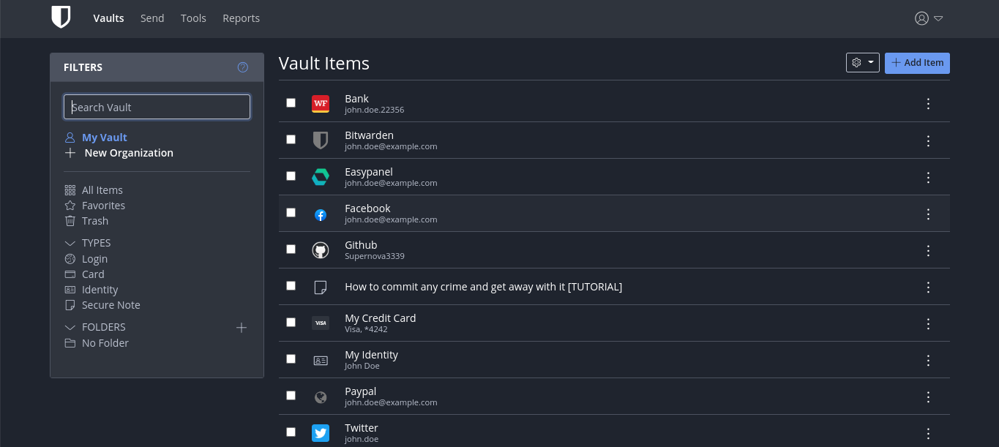
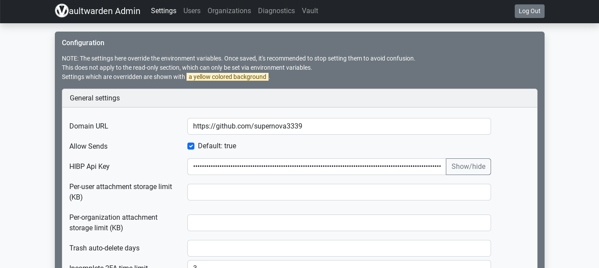
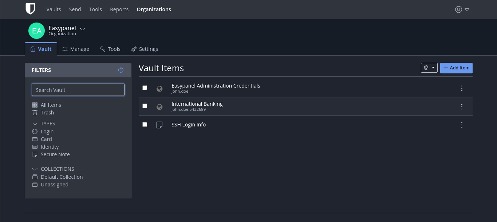

# Vaultwarden Wiki

Instructions for setting up Vaultwarden

[Vaultwarden Documentation](https://github.com/dani-garcia/vaultwarden/wiki) 

**Table of Contens:**

1. [What is Vaultwarden?](#what-is-vaultwarden)
1. [Why Vaultwarden?](#why-vaultwarden)
1. [Features](#features)
1. [Vaultwarden Installation](#vaultwarden-installation)
   
   ## What is Vaultwarden
   
   1. Vaultwarden is an open-source software project that serves as a self-hosted password manager and a compatible alternative to Bitwarden, a popular password manager service. Bitwarden was originally an open-source project, but it transitioned to a closed-source model for some of its components, which led to the development of community-driven open-source alternatives like Vaultwarden.

   1. Vaultwarden is essentially a server implementation of the Bitwarden API, allowing individuals or organizations to host their own password management service. By self-hosting Vaultwarden, users can have greater control over their password data, reduce reliance on third-party services, and customize their password manager to their specific needs.

   ## Why Vaultwarden?

   - Open-source
   - Self-host

   ## Features

   1.   Organizations support
   1.   Attachments and Send
   1.   Vault API support
   1.   Serving the static files for Vault interface
   1.   Website icons API
   1.   Authenticator and U2F support
   1.   YubiKey and Duo support
   1.   Emergency Access

   ## Vaultwarden Installation 
```yml
   
version: "3"
services:
  vaultwarden:
    image: vaultwarden/server:latest
    container_name: vaultwarden
    environment:
      - WEBSOCKET_ENABLED=true
      - SIGNUPS_ALLOWED=true
    volumes:
      - ./config:/config
    ports:
      - 80:80
      - 3012:3012
    restart: unless-stopped
```

---

> By failing to prepare, you are preparing to fail.
> 
-- **Benjamin Franklin**

[](https://easypanel.io/docs/templates/vaultwarden#screenshots)
[](https://easypanel.io/docs/templates/vaultwarden#screenshots)
[](https://easypanel.io/docs/templates/vaultwarden#screenshots)

